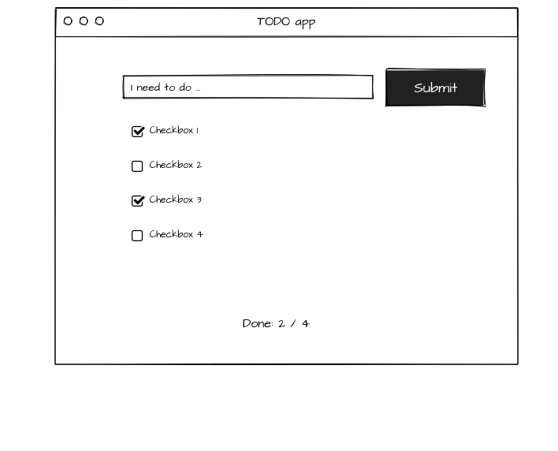

## Let's do some fun with React hooks

The goal in this task is to make the todo list to work with React hooks

- Make *src/components/Item/Item.js* to work
- Use `useReducer` to handle adding and updateing items
- Use `useContext` to update the total counter

### Advanced

- When adding an item:
  1. Call the api
  2. Set the button's text to "Adding.."
  3. Wait for fulfilled
  4. Set the button's text back to "Add"
  5. Add the item to the list

